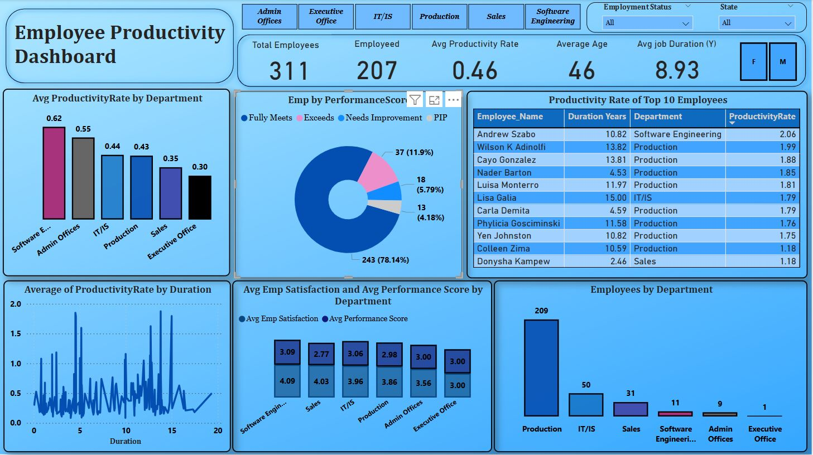
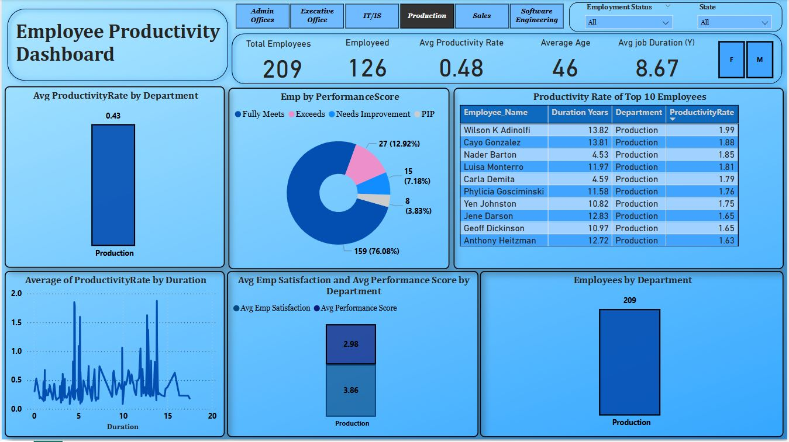
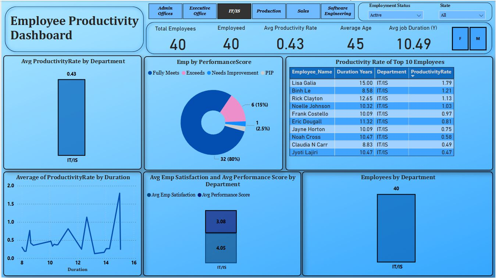

# Employee Productivity Dashboard Analysis
 Build a dashboard to monitor employee performance metrics such  as tasks completed, hours worked, and productivity rates.

* KPI Cards:
Show key metrics like total employees, employed count, average age, productivity rate, and average job duration.

* Department Filter Navigation:
Enables quick views and analysis by department such as Production, IT/IS, Sales, etc.

* Avg Productivity Rate by Department:
A bar chart comparing productivity averages across all departments.

* Employee Performance Score Distribution:
A donut chart that categorizes employees based on performance ratings (Fully Meets, Exceeds, Needs Improvement, PIP).

* Top 10 Employee Productivity Table:
Displays top performers with details like department, duration, and productivity rate.

* Productivity vs. Duration Scatter Plot:
Highlights the relationship between tenure and productivity rate.

* Satisfaction & Performance Comparison:
A stacked bar chart comparing average employee satisfaction and performance score across departments.

* Department-wise Employee Count:
A column chart showing the number of employees in each department.

